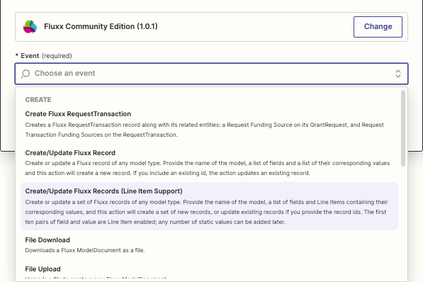
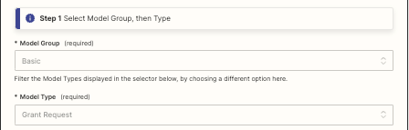
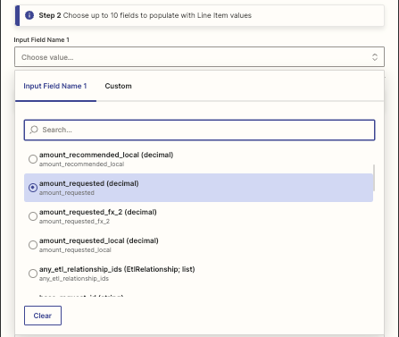

### Create/Update Fluxx Records (Line Item Support)

<p align="center"></p>

This Action creates or updates a set of Fluxx records based on parameters provided in Line Items from a previous step. If Ids are provided, the relevant records are updated. If not, new records are created.

Operating with Line Items has a significant advantage over using the non-line-item version: only one Zapier task is used to process the entire list, instead of one task per list item.

It is up to you to ensure that all required fields are given valid values.

The core of this Action is to provide lists of the field *names*, and field *values* to assign to those field names. The first pair of lists (Steps 2 & 3) can accept *Line Items*, and the lists in Steps 4 & 5 can only accept static values.

Example of Line Item values: ["Kids Inc","Safe & Free Trust","Feed the People Trust"]. These could be used for the Organization Name. Note that these need to be provided by a trigger or action that outputs Line Items.

Example of Non-Line Item value: 608. This could be the user id of the user to use as the "updated_by" field, as it would be the same for all records saved by this action.

* **Input**

  * **Step 1: Select Model Group, then Type**

<p align="center"></p>

    * **Model Group** (required): As there are so many model types to choose from, they have been broken down into four lists: Basic, Intermediate, Dynamic Models only, and All. This filters the Model Types shown in the Model Type field. "Basic" contains Document, Grant Request, Initiative, Organization, Program, Project, Request Report, Request Transaction, Sub Initiative, Sub Program, and User.
    * **Model Type** (requred): accepts model types in both styles: grant_request or GrantRequest. You must specify a Model Type before the Field List for Update/Create control will appear.
 
  * **Step 2: Choose up to ten fields to populate with Line Item values**
 
  <p align="center"></p>

   * Input fields appear here once you select a Model Type, above.
    * In Input Field Name 1-n, use the drop-down to select a field that you want to populate.
    * A new, empty dropdown will appear after you fill in the existing field(s). Use one dropdown per field that you want to populate.

  * **Step 3: Populate the fields with Line Item values**
    * **Step 3a: Choose a line item of the record id (for editing) or leave blank to create a new record**
      * Enter the Line Items for the id of the record to update, or leave blank to create new records instead of updating existing ones.
    * **Step 3b: Choose values for any fields chosen above**
      * Select Line Items (or static values) to match up with the list of input fields in Step 2. Only ten Line Item fields & values can be chosen.

  * **Step 4: Choose any extra fields you want to populate (non-line item)** e.g. *updated_by_id*
    *  This multiple-select control knows about all Core and Dynamic fields available for the Model Type you specified in Step 1.
    * The list of Core fields is followed by the list of Dynamic fields.
    * Each time you select a field, a new box appears below in order for you to specify another field. In this way, you first need to specify all the fields that you are going to update/create.
    * After you enter each field name, more information about that field appears in a list below the Field List

e.g.
```
Core field: model_theme_id
  • This is the ID of the theme that the record is using to render.
  • type: relation (ModelTheme) [links to API docs for ModelTheme on your Fluxx instance]
```

* Input (continued)
  * **Step 5: Choose values for the extra fields** (required)
    * For each of the fields in the Extra Fields List (above), you need to specify a value. Like the Extra Fields List, each time you fill in a value a new box appears below.
    * You must have the same number of boxes in the Value List as you have boxes in the Extra Fields List. The first box in the Extra Fields List matches with the first box in the Value List, the second box in the Extra Fields List matches with the second box in the Value List, etc.
    * For boolean values, use 1 for true and 0 for false.
    * For foreign keys (most fields that end in "_id"), either hard-code an id, or you may need to perform another search to retrieve the required id. To set the id to null, leave the text field blank.
    * Multi-attribute values (select controls that allow more than one value, and/or percentage) can be specified using a [special syntax](../Special/Multi_Value_Fields.md) that allows you to _remove_ existing selections and/or add selections. It cannot create Model Attribute Values that do not already exist in the system.

  * **Step 6: Choose the fields you want to return to Zapier**
    * Enter the list of fields you want to return from the updated or created record. Use one per box. The list of fields depends on which Model Type is chosen in Step 1.