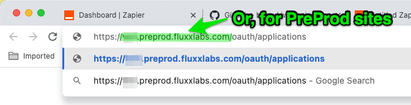
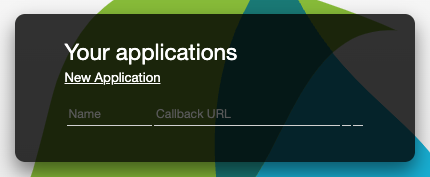
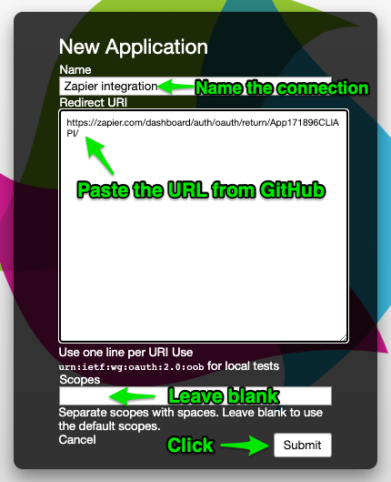
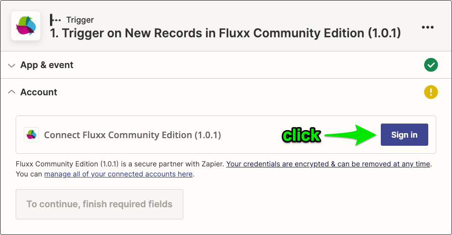

## Getting Started
> FCE is third-party, open source software. As it is not provided or endorsed by Fluxx, the Zapier integration is a Private rather than Public integration. i.e. you will not find FCE in Zapier's standard list of integrations. To use it, follow [this link](https://zapier.com/developer/public-invite/171896/79f0f6177294d5882a4e1eb79aa80fef/) to add it to your Zapier account.

### Public vs Private Zapier Integrations

Zapier has two levels of integrations/apps. Public integrations are "first-class citizens": the integrations go through a rigorous assessment by Zapier staff and are then listed and available for all Zapier users. In order for an integration to go public, it has to be developed by the owner of the API (Fluxx) or an authorised contractor. Third-party developers cannot make their integrations Public in this way, but they may make their Private integration available via invite or [by link](https://zapier.com/developer/public-invite/171896/79f0f6177294d5882a4e1eb79aa80fef/).

### Use of This Software

FCE is provided free of charge. You may use it in three ways:

- The most up-to-date version of the software is available within Zapier once you have used [this link](https://zapier.com/developer/public-invite/171896/79f0f6177294d5882a4e1eb79aa80fef/).
- Developers may wish to download the source from Github, make modifications, and use it as a private integration. See the Zapier CLI documentation for how to set up a developer environment for a custom integration.
- You may use the software in any other way consistent with the MIT licence.

### Set Up API Keys in Fluxx

> Before you can connect to Fluxx from Zapier, you need to create a new pair of API keys in Fluxx. These are called the Application Id, and the Secret. You need to have Admin access in Fluxx to create and access the API keys.

1. Log in to your desired Fluxx site. You must use an account that has _Admin_ access. It is important that you do this _before_ step 2.
2. You will now set up an API *application id* and *secret* on your Fluxx Preprod and/or Production servers. You will need these in Zapier in order to connect to Fluxx. 
   1. Copy and paste the following link in your browser URL bar, then replace ``[[server url]]`` with your actual server URL. The link is: **https://[[server url]]/oauth/applications**

   

   

   

   2. When you see the following window, click *New Application*

   

   3. You will reach the following panel:

   

     * Name the application e.g. "Zapier integration"
     * Redirect URI: *copy and paste the following text:* https://zapier.com/dashboard/auth/oauth/return/App171896CLIAPI/
     * Scopes: *leave blank*
     * Click Submit
   4. The browser now shows the Application Name, Id, and Secret. Keep this window/tab open as you will need the Id and Secret (partially obscured, and highlighted in green below), later.

   

### Add the API Keys from Fluxx to Zapier

> In Zapier, this is called an "Account". Zapier will remember these credentials and will allow you to select this connection when you create/edit any Action, Trigger or Search that uses FCE.

1. If you have not already done so, follow [THIS LINK](https://zapier.com/developer/public-invite/171896/79f0f6177294d5882a4e1eb79aa80fef/) to add FCE to your Zapier account. Click on the "Accept Invite & Build a Zap" button to confirm. You only need to do this once, to gain permanent access to FCE on your Zapier login.

2. In a new browser tab, create a new Zap in Zapier
3. In the search bar under *1. Trigger*, search for *Fluxx*, then click on Fluxx Community Edition (X.Y.Z).

  

4. Choose an Event that will occur in Fluxx and trigger this Zap to start processing. e.g. "Trigger on New/Updated Records", then "Continue"

  

5. The first time you do this, you need to click on "Sign In" next to "Connect Fluxx Community Edition *(nn.nn.nn)*" to connect to your Fluxx instance.

  

   1. A popup window appears, so ensure that popup windows are enabled for Zapier.com in your browser.
   2. In Fluxx Client Domain, enter the full domain name of the Fluxx Preprod or Production site, e.g. **mydomain.preprod.fluxxlabs.com**. Do not include the leading *https://*
   3. In Fluxx Application Id, copy and paste the Application Id you created in step 2
   4. In Fluxx Secret, copy and paste the "Secret" you created in step 2
   5. Click "Yes, Continue"
   6. The browser redirects to your chosen Fluxx instance, https://[[server url]]/oauth/authorize?client_id=...
   7. If the browser takes you to the Fluxx login page, complete the login then close the popup window and repeat from step 7i again.
6. Finish setting up the trigger. The "Trigger on New Records" trigger could use a trigger such as: `SELECT id, full_name FROM User ORDER BY updated_at desc LIMIT 100` to take the latest 100 records, and trigger on any new ones found.
7. Perform the Test Trigger step to ensure that Zapier is able to retrieve records from Fluxx. Zapier will pull in the latest three individual records and name them SQL Records Search Results [A-C].

If the authentication succeeds, congratulations! You are now ready to start automating Fluxx actions.
