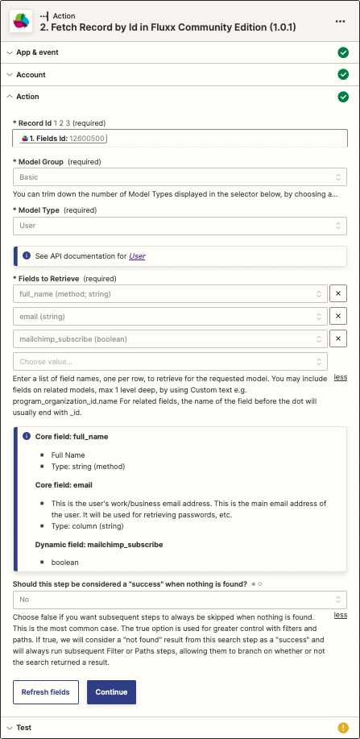

### Fetch Record by Id

> This action allows you retrieve a Fluxx record if you know its model type and id. If you don't have the id and need to search via other fields (e.g. name, first_name, last_name etc), you should use the [Search for a Single Fluxx Record](./Search_for_Single_Fluxx_Record.md) Action instead of this one, in order to use filters for your search criteria.

<p align="center"></p>

* **Input**
  * **Record Id**: The id of the record. You can add this as a static number, or use an id result from a previous action or search.

  * **Model Group**: Use this dropdown to filter the list of model types that appears in the next control.
    * "Basic" gives Grant Request, Initiative, Model Document, Organization, Program, Project, Request Report, Request Transaction, Sub Initiative, Sub Program, and User.
    * "Intermediate" adds a set of less-frequently used models.
    * "Dynamic Models Only" lists any dynamic models you may have created.
    * "All" lists all core models and all dynamic models.

  * **Model Type**: Select the Model Type of the record you want to retrieve.
    * Once you have chosen a Model Type, an info panel appears below the Model Type with a link to the API documentation on your Fluxx site for that model.

  * **Fields to Retrieve (required)**: Enter a list of field names, one per row, to retrieve for the requested model. Because you indicated the model type above, the dropdowns contain all the core and dynamic fields for that model type. You may also include fields on related models, max 1 level deep, by using Custom text e.g. program_organization_id.name For related fields, the name of the field before the dot will usually end with _id.
    * Once you have chosen at least one field, an info panel appears below the list of fields with more information about each field to be returned.

  * **Should this step be considered a "success" when nothing is found?**: Sometimes it matters if the requested record exists, and sometimes it doesn't. Choosing "No" causes all subsequent steps to be skipped when nothing is found.

* **Output**
```
id: 17443
model_type: bank_account
fields:
  id: 17443
  account_name: Save The Kids Trust
  account_number: 12-3456-1234567-000
  (all other requested fields appear here)
```