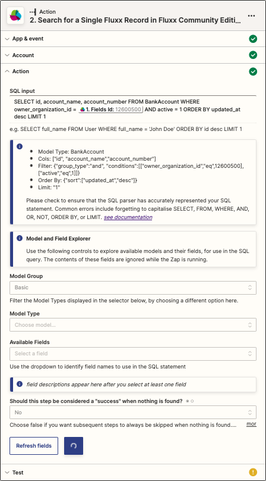

### Search for a Single Fluxx Record

> This action allows you retrieve a Fluxx record via arbitrary SQL-like search. If you already have a record id, you should use the [Fetch Record by Id](./Fetch_Record_by_Id.md) Action instead of this one. This Action is better suited to more complex retrievals where you do not have the id of the record, and have to search with a more complex filter.

As the search may return more than one item, only the _first_ item returned will be used by Zapier, so you may wish to use an `ORDER BY` clause, and `LIMIT 1` in order to place the most relevant item at the start of the list. e.g.

* to use the most recent match: `ORDER BY updated_at desc LIMIT 1`
* to use the largest grant request: `ORDER BY amount_requested desc LIMIT 1`

<p align="center"></p>

* **Input**
  * **SQL input**: see [_SQL Support_](../Special/SQL_Support.md) e.g. `SELECT id, account_name, account_number FROM BankAccount WHERE owner_organization_id = [[ id from previous step ]] AND active = 1 ORDER BY updated_at desc LIMIT 1`
    * Below the SQL input, an info panel shows the information that FCE parsed from the SQL statement. It is useful to check the info in this to ensure that it picked up all the fields and correctly interpreted the filter (the WHERE conditions). If you do not see a parameter that you thought you had included in the SQL, check the SQL syntax.

  * **Model and Field Explorer**
    * It can be hard to remember field names when listing them in the SQL statement. The Model and Field Explorer allows you to select the model type, then use dropdowns to see all valid field names for that model.
    * Choosing anything in Model Group, Model Type and Available Fields does not affect the search or what is returned. However, having values set in these fields can cause some additional API calls when the Zap is published. Therefore, it is best to set the Model Type to Basic and clear the Model Type field before you publish the Zap.

  * **Should this step be considered a "success" when nothing is found?**: Sometimes it matters if the requested record exists, and sometimes it doesn't. Choosing "No" causes all subsequent steps to be skipped when nothing is found.

* **Output**
```
id: 17443
model_type: bank_account
fields:
  id: 17443
  account_name: Save The Kids Trust
  account_number: 12-3456-1234567-000
  (any other requested fields appear here)
```